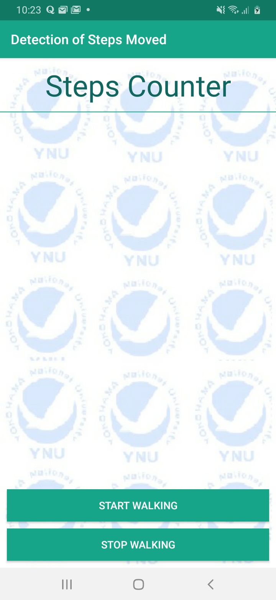

# Pedometer
<h2> Android application to count number of steps whenever there is acceleration sensed in any particular axis using Kotlin Programming Language. The system uses the accelerometer installed in the mobile device to estimate the distance moved by counting the number of steps.
 \
 
 
  
 
 
  
  
  
  
  
  

 
