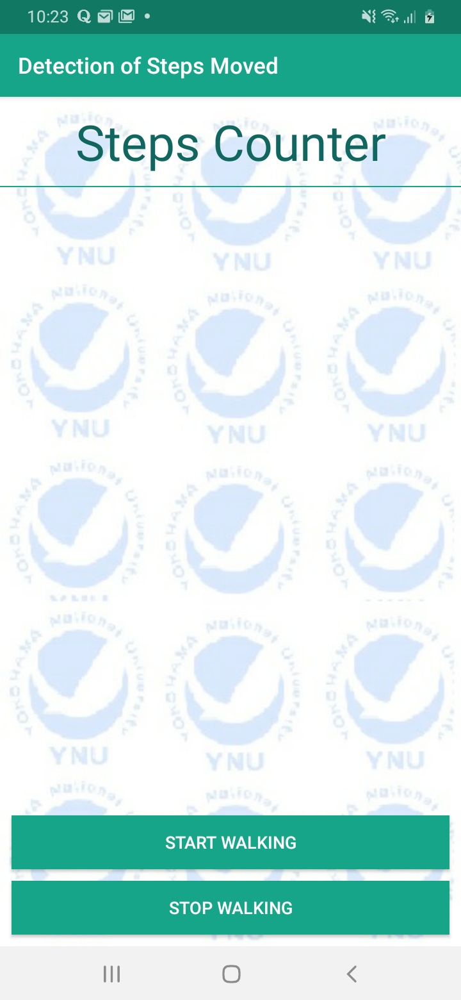
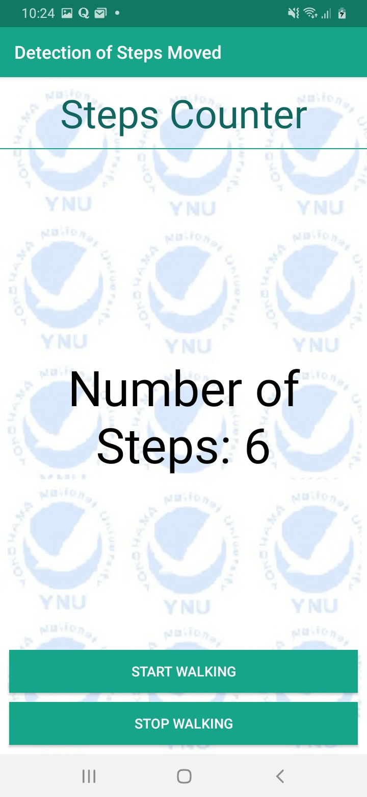
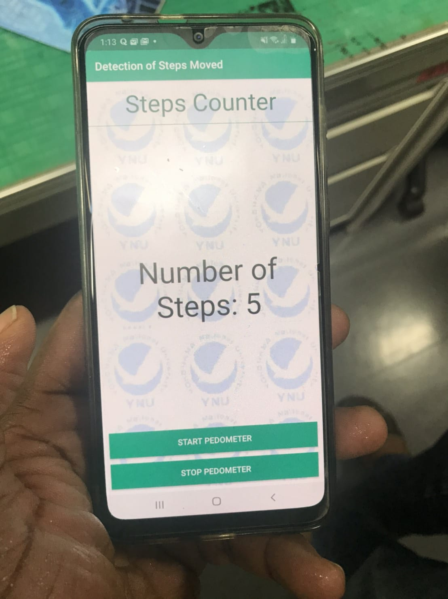

# Pedometer

## Concept
The idea is to design a human sensing system that can detect the number steps moved. The end product is a simple android app that counts the number of steps as steps are moved when the device is held.

The system uses the accelerometer installed in the mobile device to estimate the distance moved by counting the number of steps. The data measured by the accelerometer in the x, y and z-axis direction are used to determined if a step is been moved or not.

## Starting

## online testing...

## Results

## how experiment was conducted
Here is a short video showing how the experiment was conducted.

